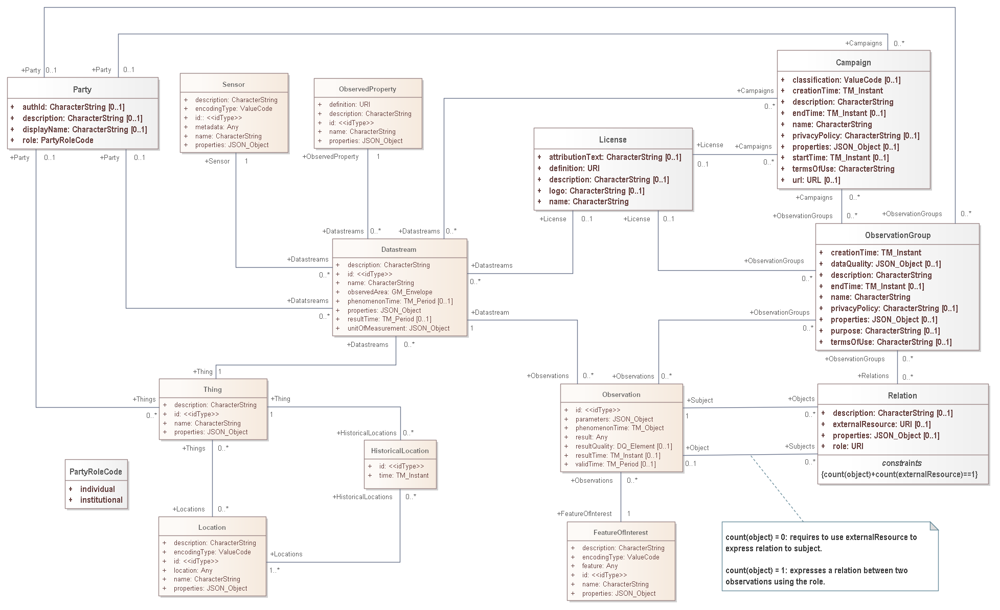

# Sensor Things API - PLUS (STAplus)
This repository contains an open source reference implementation of STAplus as a plugin for [FROST-Server v2.4.0](https://github.com/FraunhoferIOSB/FROST-Server/tree/v2.x).

**_NOTE_:** This implementation is still work in progress. The source code is already available in this repository to give you the opportunity to follow along or actually contribute.

**_IMPORTANT_: Do not yet use in production!**

## About the OGC STAplus Standard
[STAplus](https://docs.ogc.org/is/22-022r1/22-022r1.html) is an OGC Implementation Standard that extends the suite of OGC SensorThings API [v1.0](https://docs.ogc.org/is/15-078r6/15-078r6.html) and [v1.1](https://docs.ogc.org/is/18-088/18-088.html) Standards.

<cite>"STAplus - SensorThings API extension PLUS - defines a SensorThings data model extension to improve FAIR principles when exchanging sensor data including licensing and ownership information. The STAplus extension is fully backwards compatible to the existing OGC SensorThings API Part 1: Sensing Version 1.0 and 1.1 and thereby offers existing deployments to easily upgrade to STAplus."</cite>[^22_022r1]

[^22_022r1]: [OGC SensorThings API Extension: STAplus 1.0](https://docs.ogc.org/is/22-022r1/22-022r1.html)

The following UML diagrams illustrate the data model extension towards SensorThings API `Datastream` and `MultiDatastream`.

**_NOTE:_** The yellow colored classes belong to the SensorThings API data model.

### STAplus Data Model connected to `Datastream`


### STAplus Data Model connected to `MultiDatastream`
 with PLUS extension")


## About the Implementation
This repository contains an open source reference implementation of STAplus as a [FROST-Server](https://github.com/FraunhoferIOSB/FROST-Server) plugin.

This implementation supports the conformance classes `Core`, `Authentication` and `Business Logic`  as defined in the STAplus Standard. The `API` conformance class is already supported by the FROST-Server implementation.

### Business Logic
This implementation enforces the concept of ownership as explained in detail below. Please see [Business Logic](/BUSINESS-LOGIC.md) for more details.

## Deployment for FROST-Server
The deployment of the STAplus plugin can integrated into a working deployment of the FROST-Server. You can follow the [FROST-Server documentation](https://fraunhoferiosb.github.io/FROST-Server/) to run your instance.

### Build and deploy STAplus standalone
Clone this directory via `git clone -b FROST-Server.v2.4.x https://github.com/securedimensions/FROST-Server-PLUS.git`. Then `cd FROST-Server-PLUS` and `mvn install`. To run the tests at the end of the `mvn install` you need to have Docker running.

Make sure you copy the `FROST-Server-2.4.0.Plugin.STAplus-1.0.1.jar` file to the appropriate FROST-Server directory and apply the STAplus specific settings below. Then restart FROST-Server.

## Deployment with FROST-Server
Use `git clone -b v2.4.x https://github.com/FraunhoferIOSB/FROST-Server.git FROST-Server.v2.4.x` to create the FROST-Server directory structure.

Then cd `FROST-Server/Plugins` and `git clone -b FROST-Server.v2.4.x https://github.com/securedimensions/FROST-Server-PLUS.git STAplus`.

Add the `STAplus` plugin to the `FROST-Server/Plugins/pom.xml`.

```xml
<modules>
        <module>Actuation</module>
        <module>BatchProcessing</module>
        <module>CoreModel</module>
        <module>FormatCsv</module>
        <module>FormatDataArray</module>
        <module>FormatGeoJson</module>
        <module>ModelLoader</module>
        <module>MultiDatastream</module>
        <module>OData</module>
        <module>OpenApi</module>
        <module>STAplus</module>
    </modules>
```

Then follow the [FROST-Server documentation](https://fraunhoferiosb.github.io/FROST-Server/deployment/architecture-packages.html) applicable to your deployment strategy.  


## Configuration
Different features of the STAplus plugin can be activated / deactivated using FROST-Server alike configuration variables:

### Enable the Plugin

As described in the [FROST-Server Plugin documentation](https://fraunhoferiosb.github.io/FROST-Server/settings/plugins.html), you need to add the plugin to the list of plugins to be loaded.

* **plugins.plugins:**
  A comma-separated list of class names, listing additional plugins to load.
  
  Add the class `de.securedimensions.frostserver.plugin.staplus.PluginPLUS` to have the plugin loaded
* **plugins.staplus.enable:**  
  Set to `true` to activate the STAplus plugin. Default: `false`.


### Configure Behavior

* **plugins.staplus.idType.observation_group:**  
  The type of the primary key column of the ObservationGroups table. Defaults to the value of **plugins.coreModel.idType**.
* **plugins.staplus.idType.license:**  
  The type of the primary key column of the Licenses table. Defaults to the value of **plugins.coreModel.idType**.
* **plugins.staplus.idType.campaign:**  
  The type of the primary key column of the Campaigns table. Defaults to the value of **plugins.coreModel.idType**.
* **plugins.staplus.idType.relation:**  
  The type of the primary key column of the Relations table. Defaults to the value of **plugins.coreModel.idType**.

**_NOTE:_** The type of the primary key column of the Party table (`plugins.staplus.idType.party`) is set to UUID by the implementation. This setting cannot be changed!

## <a name="EnforceOwnership"></a>Enforcement of Ownership
The activation of the `Enforcement of Ownership` allows to operate the STAplus endpoint in multi-user-CRUD mode. However, it requires to enable authentication using one of the existing plugins.

Each acting user is identified via a unique UUID, based on the username (`REMOTE_USER`) provided by the authentication plugin. The `REMOTE_USER` value is used to identify the user. In case the `REMOTE_USER` value is not in UUID format, this plugin will create a UUIDv4 from the `REMOTE_USER` value! This UUID value is used for the `Party.@iot.id` and `Party.authId` property. When creating a `Party` object, the value for the `authId` property can be omitted. If you set the `authId` value in the request, it must match the UUIDv4 representation for the `REMOTE_USER`. All other values are rejected by the implementation and will result in a response with HTTP status code 400.

The classes `Thing`, `MultiDatastream`, `Datastream` and `ObservationGroup` are directly associated to a Party. Objects of class `Observation` are linked to the owning Party object via the `(Multi)Datastream`. Objects of class `Relation` are linked to the Party object via the `Subject` property.

When activating the Concept of Ownership, the implementation enforces the multiplicity `[1]` on the association of these classes to `Party`. Therefore, creating objects of class `Thing`, `MultiDatastream`, `Datastream` or `ObservationGroup` require the association with the Party object that represents the acting user. 

A user can `update` or `delete` any object owned. However, the user *cannot* delete the own Party. This requires admin access.

### Settings

**plugins.staplus.enable.enforceOwnership:**  
Set to `true` to enable the enforcement of ownership. Default: `false`.

## Party Singleton
This STAplus implementation creates a `Party` entity for the acting user if the `Authentication` conformance class is enabled. To prevent that the implementation creates a new `Party` entity for each request, it is **IMPORTANT** to allow client-side id generation. The `id` generation is controlled via this general setting:

```xml
<Parameter override="false" name="persistence.idGenerationMode" value="ServerGeneratedOnly" />
```

### Setting
**P L E A S E make sure that you include the following configuration to ensure that a `Party` entity exists only once per user:**

```xml
<Parameter override="false" name="persistence.idGenerationMode.Party" value="ClientGeneratedOnly" />
```
This configuration overwrites the `id` generation for the `Party` entity only.


## <a name="EnforceLicensing"></a>Enforcement of Licensing
According to the STAplus Data Model, a `Datastream`, `ObservationGroup` and `Campaign` may have a `License` association. In order to ensure the use of compatible licenses, this implementations generates a given set of configured licenses.

A user can clone a global license to set the `attributionText` and associate that license to a `Datastream` or `MultiDatestream`. But, when creating a new License, the `definition` URI must remain the same.

### Settings
The file `resources/tables.xml` contains as the last constructor for table generation the entry 
```xml
    <include relativeToChangelogFile="true" file="insertCCLicenes.xml" />
```
The file `insertCCLicenses.xml` contains the set of licenses that are generated by the implementation. 

You can change this configuration accordingly to load a different set of licenses.

**plugins.staplus.enable.enforceLicensing:**
Set to `true` to enable the enforcement of licensing. Default: `false`.


## <a name="EnforceGroupLicensing"></a>Enforcement of ObservationGroup Licensing

**_NOTE:_** This is not yet implemented.

When adding (an) `Observation(s)` to an `ObservationGroup`, the `Enforcement of Licensing` ensures that the `License`, associated to (an) `Observation(s)` is compatible to the `License` associated to an `ObservationGroup`.

When activating the `Enforcement of Licensing`, the plugin enforces licenses compatibility based on the Creative Commons v3 licensing model an the license compatibility according to the official cart. 

 See https://wiki.creativecommons.org/wiki/Wiki/cc_license_compatibility for more information.

The plugin creates the different Creative Commons Licenses in read-only mode as "system-wide" globals. An application cannot create new `License` objects nor can it update or delete the existing ones. An application can obtain a list of the "system-wide" licenses via the `/Licenses` path.

### Settings

**plugins.staplus.enable.enforceObservationGroupLicensing:**  
Set to `true` to enable the enforcement of licensing on `ObservationGroup` entity. Default: `false`. 

## Appreciation
Work on this implementation has being funded by the European Commission.
